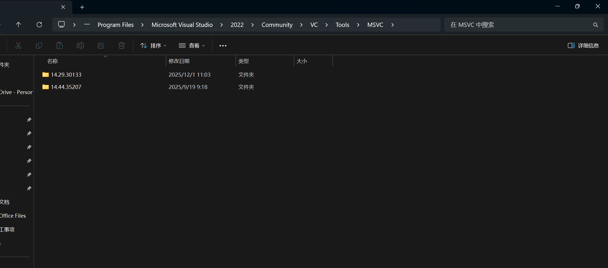
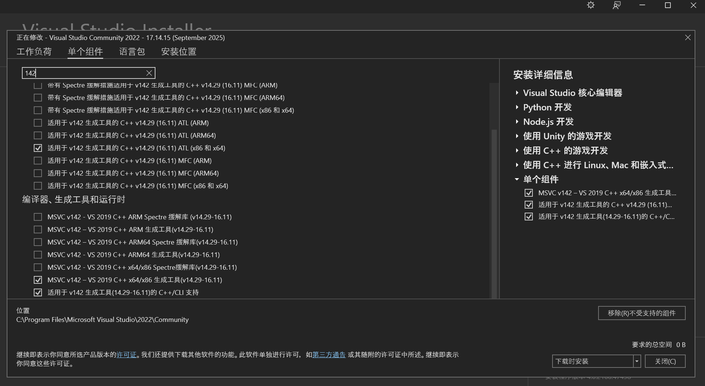
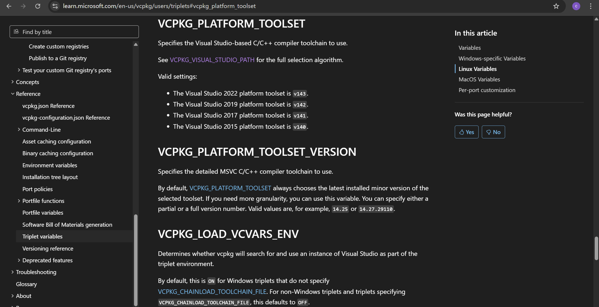
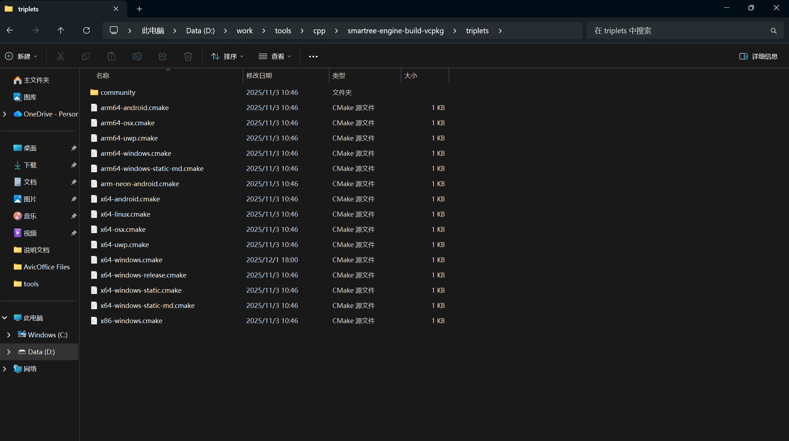
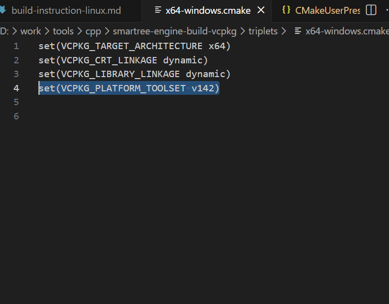

# 工具依赖
* 在visual studio中安装14.29版本的tool set
* visual studio自带的tool set会随大版本的变化而变化，我们目前是用的vcpkg baseline需要与14.29版本进行配合使用

* toolset可以通过visual studio installer进行不同版本的开发


# vcpkg配置
* vcpkg官方文档说明了如何配置vcpkg使用哪一个版本的toolset
* vcpkg的这一套机制名字为 triplets
* https://learn.microsoft.com/en-us/vcpkg/users/triplets#vcpkg_platform_toolset
* 

## vcpkg triplets配置方法
* 需要到vcpkg的repo目录下，找到下图所示的cmake文件
* 
* 在需要进行配置的平台的cmake文件中(x64-windows.cmake)，增加toolset的版本
```
set(VCPKG_PLATFORM_TOOLSET v142)
```


## 配置powershell的msvc版本
* 默认情况下，powershell会查找当前系统中安装的最新版本的msvc
* cmd时代，可以使用下面的脚本进行msvc的版本切换，但是powershell里会无法生效
```
"C:\Program Files\Microsoft Visual Studio\2022\Community\VC\Auxiliary\Build\vcvarsall.bat" x64 -vcvars_ver=14.29.30133
```
* powershell需要使用下面的方式切换当前激活的msvc版本到v142
```
Import-Module "C:\Program Files\Microsoft Visual Studio\2022\Community\Common7\Tools\Microsoft.VisualStudio.DevShell.dll"; Enter-VsDevShell -VsInstallPath "C:\Program Files\Microsoft Visual Studio\2022\Community" -DevCmdArguments "-arch=amd64 -host_arch=amd64 -vcvars_ver=14.29.30133"
```
* msvc的具体版本可以在该路径下查看
```
C:\Program Files\Microsoft Visual Studio\2022\Community\VC\Tools\MSVC
```
* 激活完成后，可以使用cl命令确认当前的msvc版本号

# 需要修改的依赖项目录配置
* .vscode/c_cpp_properties.json中的compilerPath
* vcpkg-configuration.json中的vcpkg repo的路径
